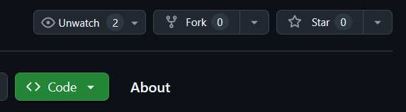
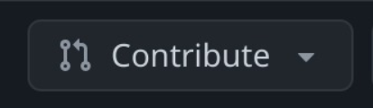

## Bem-vindo(a)! 
Se você chegou até aqui, é provável que tenha interesse em contribuir com o <strong>CondoSync</strong>, um sistema de gestão de condomínios desenvolvido com foco em eficiência e organização. O CondoSync foi criado para facilitar a administração condominial, oferecendo uma plataforma moderna para o controle de moradores, finanças, reservas de áreas comuns, comunicados e muito mais.
Nosso objetivo é tornar a vida de síndicos, administradoras e condôminos mais simples e conectada, promovendo uma gestão transparente e centralizada.
Antes de começar a colaborar com o projeto, leia este guia para entender melhor como o sistema funciona e de que forma você pode contribuir para torná-lo ainda melhor. Seja com código, testes, documentação ou sugestões, sua ajuda é muito bem-vinda!

<br>

## Como contribuir:
Você pode colocar uma nova funcionalidade em prática, solucionar alguma issue do projeto (botão abaixo) ou adicionar uma melhoria.
<br>
<p align="center">
  <a href="https://github.com/rafaferraz05/CondoSync/issues">
    
  </a>
</p>

<br>

## Configurando o repositório

<strong>1º) Fork do Repositório:</strong> Faça um Fork para levar uma cópia do repositório para a sua conta.  Dessa forma, você pode realizar suas modificações sem impactar o repositório original. 
<br>
<p align="center">
  
</p>

<strong>2º) Clonar o repositório:</strong> 
```
git clone https://github.com/rafaferraz05/CondoSync.git
```

<strong>3º) Criar sua própria Branch:</strong> 
```
git checkout -b minha-nova-funcionalidade
```

<br>

## Configurando o ambiente de desenvolvimento

<strong>1º) Entre no Diretório do Projeto:</strong>
```
cd CondoSync
```

<strong>2º) Crie um Ambiente Virtual:</strong>
```
python -m venv venv
```

<strong>3º) Ative o Ambiente Virtual:</strong>
```
Windows: venv\Scripts\activate
Linux/Mac: source venv/bin/activate
```

<strong>4º) Instale as Dependências:</strong>
```
pip install -r requirements.txt
```

<strong>5º) Aplique as Migrations (Criar o Banco de Dados):</strong>
```
python manage.py migrate
```

<strong>6º) Rode o Servidor:</strong>
```
python manage.py runserver
```

## Caso queira garantir que o código adicionado não quebre outras partes da aplicação:
rode os testes existentes e, caso necessário, crie novos testes. Para fazer isto:

<strong>1º) Baixe o <a href="https://nodejs.org/en" target="_blank">Node</a> na sua versão LTS:</strong>

<strong>2º) Instale as dependências:</strong>
```
npm ci
```

<strong>3º) Rode os testes com:</strong>
```
npx cypress run
```

<br>

## Confirmando suas Alterações
Abra um Pull Request com uma descrição das alterações realizadas.

<strong>1º) No repositório que você deu fork, clique em ```Contribute```:</strong>

<p align="center">
  
</p>

<strong>2º) Depois clique em ```Open pull request```</strong>

<strong>3º) Agora selecione o repositório que você deu fork e a branch que você fez suas alterações</strong>

<strong>4º) Então, para criar seu PR, clique em ```Create pull request```</strong>

<strong>5º) No final:</strong>

A equipe do **CondoSync** irá revisar sua submissão e, caso algo não esteja em conformidade com o projeto, entraremos em contato para ajustar o seu código.

<br>

## 🙏 Agradecimentos!

A equipe do **CondoSync** agradece imensamente pela sua contribuição! Cada sugestão, melhoria e ajuste faz uma grande diferença para que possamos oferecer um sistema de gestão hospitalar ainda mais eficiente e otimizado para os profissionais de saúde.

Estamos animados para ver suas ideias em ação e trabalharmos juntos para transformar o atendimento e a organização de dados dos pacientes.

<br>

Se precisar de qualquer coisa ou tiver dúvidas durante o processo, não hesite em entrar em contato. Muito obrigado por ajudar a tornar o **CondoSync** cada vez melhor!

<br>
<br>
Fale com a gente:
<p align="center">
  <table>
    <tr>
      <td align="center">
        <a href="https://github.com/caioguimaraesr">
          
          <br>
          <strong style="font-size: 12px;">🚀 Caio G Rocha</strong>
        </a>
        <br>
        <a href="mailto:cgr@cesar.school">cgr@cesar.school</a>
      </td>
      <td align="center">
        <a href="https://github.com/denysleo">
          
          <br>
          <strong>🌟 Denys Sales</strong>
        </a>
        <br>
        <a href="mailto:dlos@cesar.school">dlos@cesar.school</a>
      </td>
      <td align="center">
        <a href="https://github.com/Cavalcanti-Felipe">
          
          <br>
          <strong>💡Felipe de Mello</strong>
        </a>
        <br>
        <a href="mailto:fmcc@cesar.school">fmcc@cesar.school</a>
      </td>
      <td align="center">
        <a href="https://github.com/hugoogomess">
          
          <br>
          <strong>🎨 Hugo Gomes</strong>
        </a>
        <br>
        <a href="mailto:htng@cesar.school">htng@cesar.school</a>
      </td>
      <td align="center">
        <a href="https://github.com/mateusdinizz">
          
          <br>
          <strong>💻 Mateus Diniz</strong>
        </a>
        <br>
        <a href="mailto:mdls@cesar.school">mdls@cesar.school</a>
      </td>
      <td align="center">
        <a href="https://github.com/rafaferraz05">
          
          <br>
          <strong>🏆 Rafael Ferraz</strong>
        </a>
        <br>
        <a href="mailto:rfs6@cesar.school">rfs6@cesar.school</a>
      </td>
    </tr>
  </table>
</p>

<br>